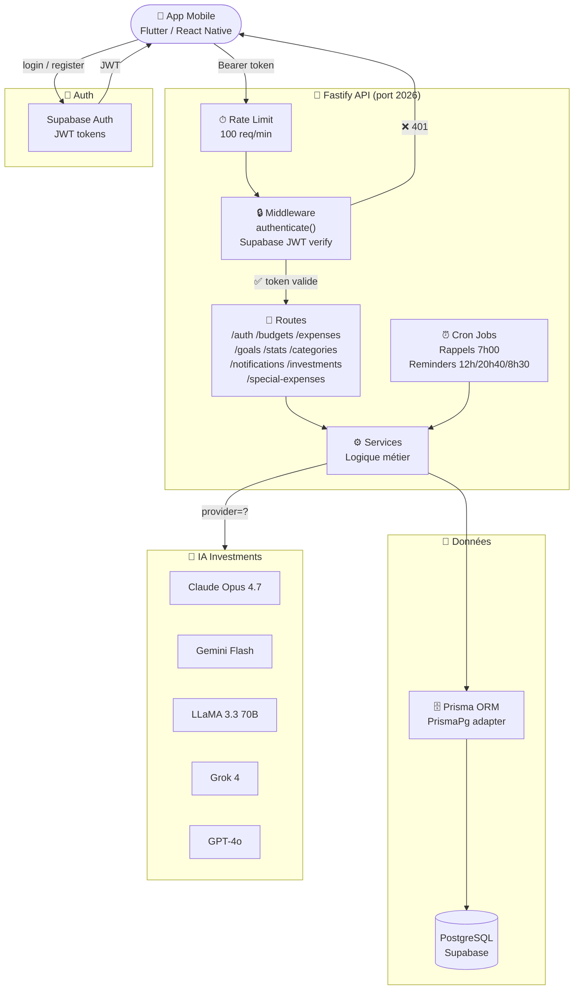
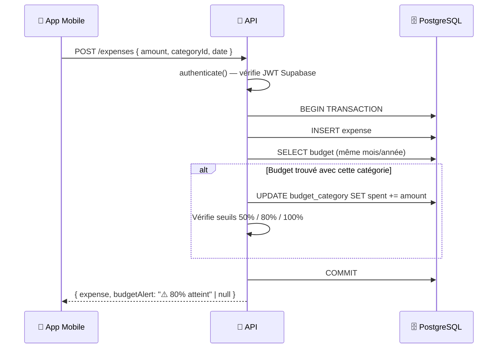
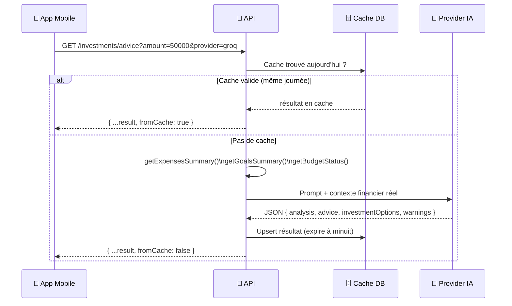

# Architecture — MoneyWise API

> Visualiser sur [mermaid.live](https://mermaid.live) ou avec l'extension **Mermaid Preview** dans VS Code.

## Vue d'ensemble des couches



---

## Flux de création d'une dépense



---

## Flux conseil IA (investments)



---

## Structure des modules

```
src/
├── app.ts                    ← Bootstrap Fastify, middlewares, routes
├── server.ts                 ← Listen, graceful shutdown, banner
├── config/env.ts             ← Variables d'environnement (Zod)
├── middlewares/
│   └── authenticate.ts       ← Vérification JWT Supabase
├── plugins/
│   ├── prisma.ts             ← Prisma client (PrismaPg adapter)
│   ├── supabase.ts           ← Supabase admin client
│   └── scalar.ts             ← Documentation API interactive
├── utils/
│   ├── response.ts           ← ok(), fail(), getBudgetStatus()
│   └── schema.ts             ← wrapResponse(), r401, r404...
├── modules/
│   ├── auth/
│   ├── budgets/
│   ├── categories/
│   ├── expenses/
│   ├── goals/
│   ├── investments/
│   ├── notifications/
│   ├── special-expenses/
│   └── stats/
└── jobs/
    ├── scheduler.ts
    ├── special-expense-reminders.job.ts
    └── daily-reminders.job.ts
```
