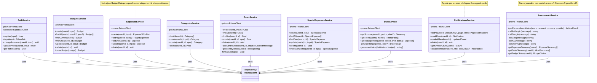

# Diagramme de Classes — Services MoneyWise

> Visualiser sur [mermaid.live](https://mermaid.live) ou avec l'extension **Mermaid Preview** dans VS Code.

```mermaid
classDiagram
    class PrismaClient {
        <<dependency>>
    }

    class AuthService {
        -prisma PrismaClient
        -supabase SupabaseClient
        +register(input) User
        +login(input) TokenPair
        +changePassword(userId, input) void
        +updateProfile(userId, input) User
        +getProfile(userId) User
    }

    class BudgetsService {
        -prisma PrismaClient
        +create(userId, input) Budget
        +findAll(userId, month?, year?) Budget[]
        +findCurrent(userId) Budget
        +findOne(userId, id) Budget
        +update(userId, id, input) Budget
        +delete(userId, id) void
        -formatBudget(budget) Budget
    }

    class ExpensesService {
        -prisma PrismaClient
        +create(userId, input) ExpenseWithAlert
        +findAll(userId, query) PagedExpenses
        +findOne(userId, id) Expense
        +update(userId, id, input) Expense
        +delete(userId, id) void
    }

    class CategoriesService {
        -prisma PrismaClient
        +findAll(userId) Category[]
        +create(userId, input) Category
        +update(userId, id, input) Category
        +delete(userId, id) void
    }

    class GoalsService {
        -prisma PrismaClient
        +create(userId, input) Goal
        +findAll(userId) Goal[]
        +findOne(userId, id) Goal
        +update(userId, id, input) Goal
        +delete(userId, id) void
        +addContribution(userId, id, input) GoalWithMessage
        +getMonthlyRecap(userId) RecapItem[]
        -formatGoal(goal) Goal
    }

    class SpecialExpensesService {
        -prisma PrismaClient
        +create(userId, input) SpecialExpense
        +findAll(userId) SpecialExpense[]
        +findOne(userId, id) SpecialExpense
        +update(userId, id, input) SpecialExpense
        +delete(userId, id) void
        +markCompleted(userId, id, input) SpecialExpense
    }

    class StatsService {
        -prisma PrismaClient
        +getSummary(userId, period, date?) Summary
        +getTrend(userId, months) TrendPoint[]
        +getTopExpenses(userId, period, limit, date?) Expense[]
        -getDateRange(period, date?) DateRange
        -generateAdvice(distribution, budget) string[]
    }

    class NotificationsService {
        -prisma PrismaClient
        +findAll(userId, unreadOnly?, page, limit) PagedNotifications
        +markRead(userId, id) Notification
        +markAllRead(userId) UpdatedCount
        +delete(userId, id) void
        +getUnreadCount(userId) Count
        +createReminder(userId, title, body, data?) Notification
    }

    class InvestmentsService {
        -prisma PrismaClient
        +getPersonalizedAdvice(userId, amount, currency, provider) AdviceResult
        -callAnthropic(message) string
        -callGoogle(message) string
        -callGroq(message) string
        -callXAI(message) string
        -callOpenAI(message) string
        -getExpensesSummary(userId) ExpenseSummary[]
        -getGoalsSummary(userId) GoalSummary[]
        -getBudgetStatus(userId) BudgetStatus
    }

    AuthService       --> PrismaClient : uses
    BudgetsService    --> PrismaClient : uses
    ExpensesService   --> PrismaClient : uses
    CategoriesService --> PrismaClient : uses
    GoalsService      --> PrismaClient : uses
    SpecialExpensesService --> PrismaClient : uses
    StatsService      --> PrismaClient : uses
    NotificationsService  --> PrismaClient : uses
    InvestmentsService    --> PrismaClient : uses

    note for InvestmentsService "Cache journalier par userId+provider\nSupporte 5 providers IA"
    note for ExpensesService "Met à jour BudgetCategory.spent\nautomatiquement à chaque dépense"
    note for NotificationsService "Appelé par les cron jobs\npour les rappels push"
```
